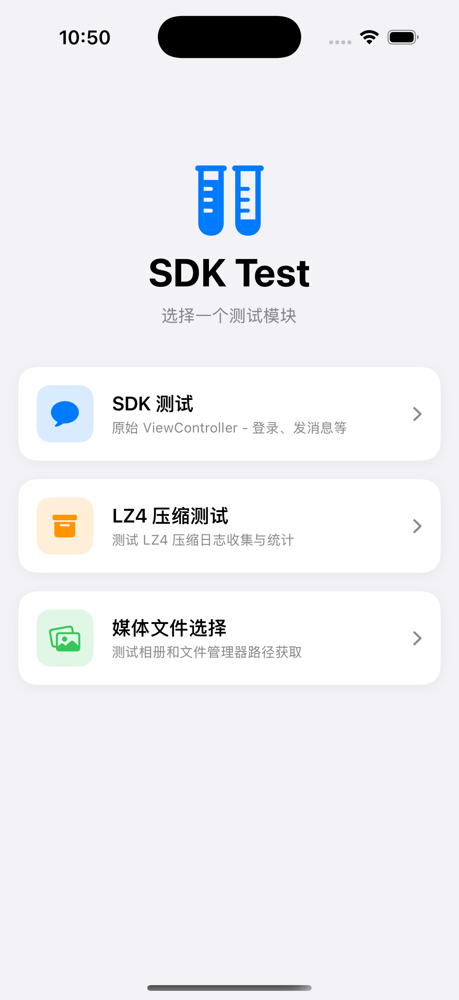

# iOS 应用工具

通过导航栏进入不同的工具。

## LZ4 压缩工具



**功能**：统计即时通讯消息的 LZ4 压缩/解压缩效率。

**环境支持**：

- **模拟器**：直接使用 Mac 文件夹路径
- **真机**：文件选择器或手动输入路径

---

### 方法1：本地发送测试

| 步骤 | 操作       | 说明                     |
| :--: | ---------- | ------------------------ |
|  1   | 初始化 SDK | 填写 AppKey 后点击初始化 |
|  2   | 登录       | 输入用户名密码登录       |
|  3   | 准备文件   | 设置测试数据文件夹路径   |
|  4   | 开始收集   | 开启 LZ4 日志收集        |
|  5   | 发送消息   | 单条或自动发送           |
|  6   | 停止收集   | 生成统计报告             |

---

### 方法2：配合 Python 工具

| 步骤 | 操作                                  |
| :--: | ------------------------------------- |
|  1   | 初始化 SDK                            |
|  2   | 登录用户 A                            |
|  3   | 开始收集日志                          |
|  4   | Python 工具：用户 B → 用户 A 发送消息 |
|  5   | 停止收集，查看统计                    |

> Python 工具详见 `send_message/README.md`

---

### 测试数据格式

JSON 文件，每行一条消息：

```json
{ "payload": { "bodies": [{ "action": "消息内容" }] } }
```

---

### 输出报告

路径：`Documents/output.md`

包含每条消息的压缩信息和汇总统计（压缩率、总大小等）。
